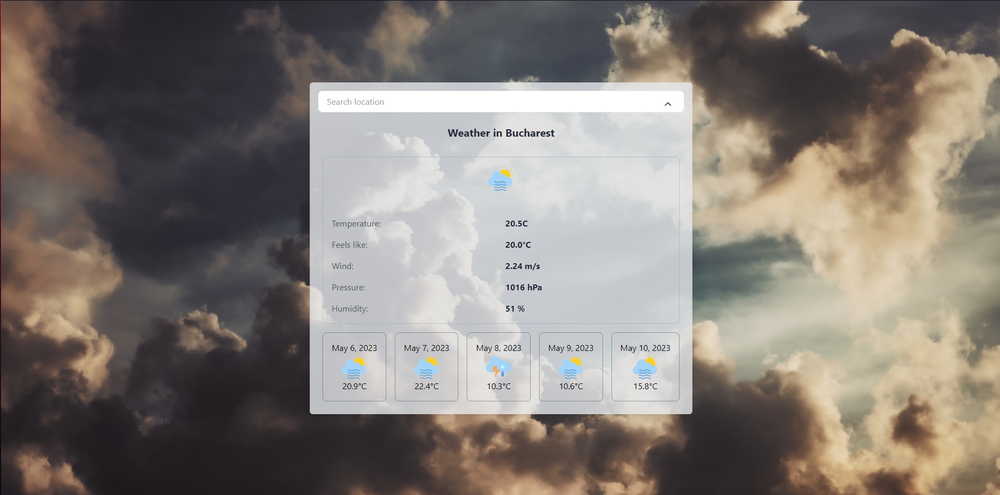

# React Weather App

This is a simple weather app built with React that allows users to search for weather information for a particular city. The app uses the OpenWeatherMap API to retrieve current weather data and display it to the user.

# Information

In this weather app, **React** is used to create the user interface, and it leverages **useEffect** and **useState** hooks to manage the application state and to fetch data from the **OpenWeather API**.

When the user types in a location in the search bar, the app sends a request to the OpenWeather API to retrieve the current weather data and geographic coordinates (latitude and longitude) of the location. This data is then passed down to its components.

The **Weather** component receives the current weather data and renders it to the screen, along with the location name, date and time, and a background image that corresponds to the current weather conditions. The background image is selected based on the weather description obtained from the API, and is managed using useState hook.

The **MultipleWeather** component receives the latitude and longitude coordinates of the location and uses them to fetch five-day weather forecast data from the OpenWeather API. It then renders the forecast data for the next five days in a table format.

**Tailwind** CSS is used to style the user interface, making use of its utility classes to provide responsive design and consistent styling across different screen sizes.

Overall, the app makes use of React's component-based architecture to organize the code and separate concerns, and leverages the power of hooks to manage state and side effects. The end result is a user-friendly weather app that provides up-to-date weather data and forecast information for any location in the world.

# Acknowledgements

This project was inspired by **alexkowsik/react-weather-app** and uses the** OpenWeatherMap API** to retrieve weather data.
